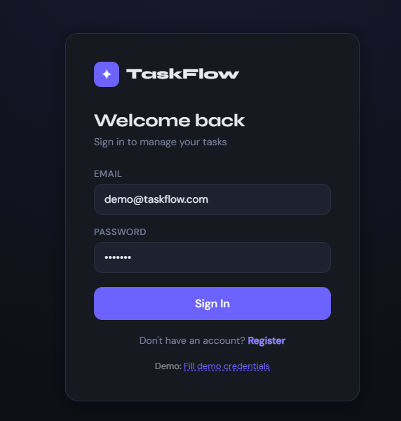
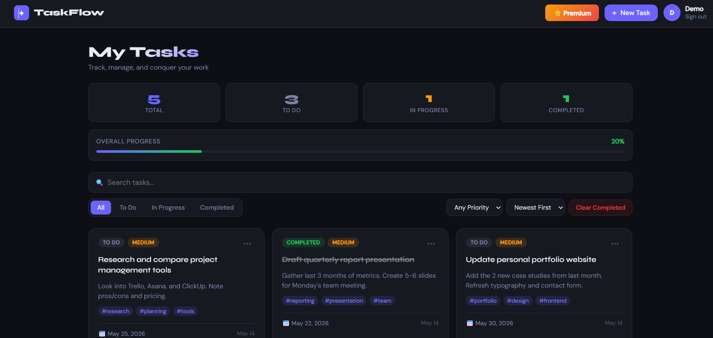
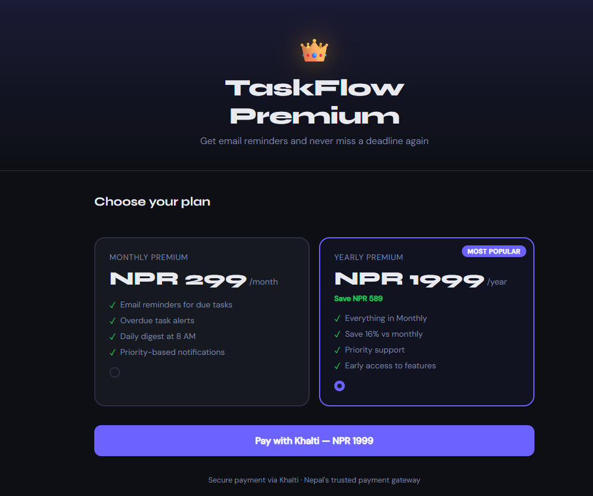
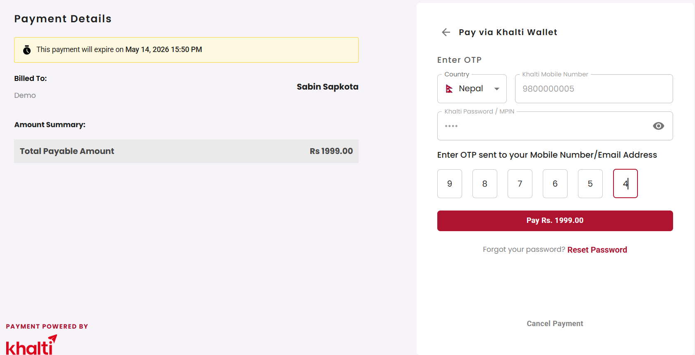
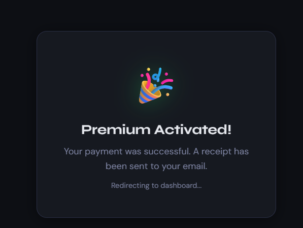
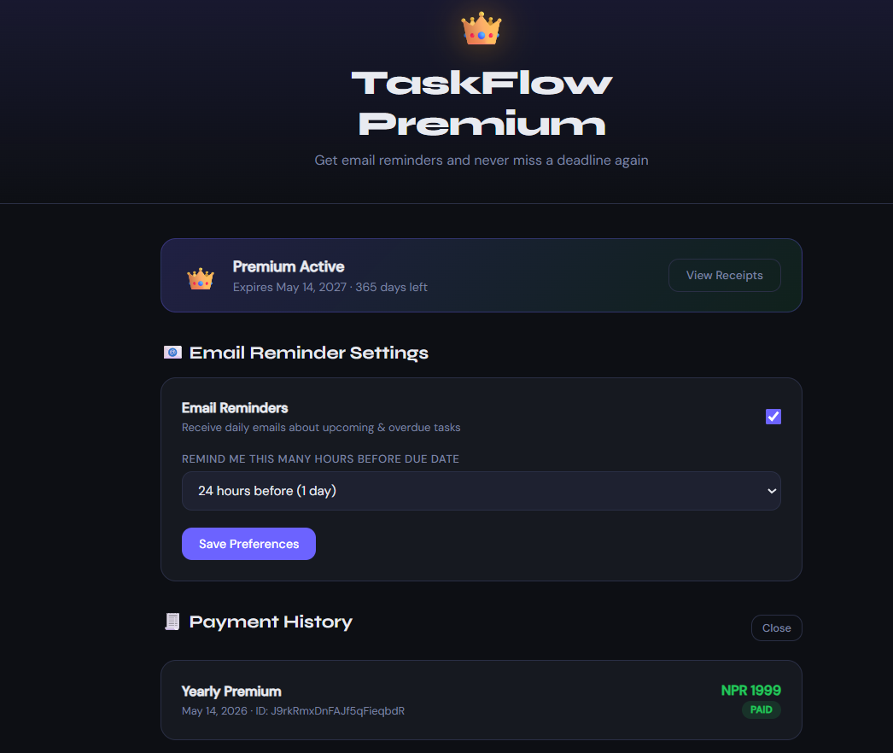
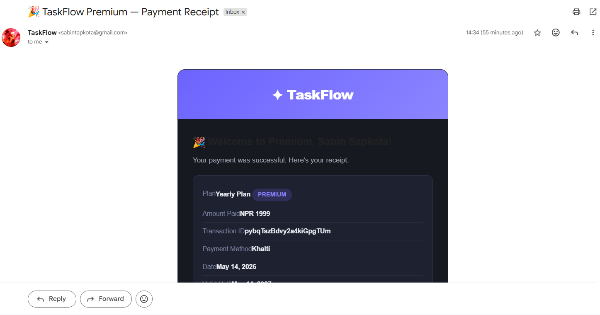

# ✦ TaskFlow — Full-Stack MERN Task Manager

**Live Demo:** https://taskmanagernp-ashen.vercel.app

A production-ready task management application built with the MERN stack (MongoDB, Express, React, Node.js) featuring **Khalti payment integration**, **premium subscriptions**, and **automated email reminders via Resend**.

---

## 📸 Screenshots

### Auth Page


### Dashboard View


### Premium Payment Page


### Khalti Payment Gateway


### Premium Activated


### Payment History


### Email Notification


---

## 🌐 Deployment Stack

| Service | Platform | Purpose |
|---------|----------|---------|
| Frontend | **Vercel** | React app hosting, free forever |
| Backend | **Railway** | Node/Express API, free tier |
| Database | **MongoDB Atlas** | Cloud database, 512MB free |
| Email | **Resend** | Transactional emails, 100/day free |

### Live URLs
```
Frontend:  https://taskmanagernp-ashen.vercel.app
Backend:   https://practical-appreciation-production.up.railway.app
```

---

## 📁 Project Structure

```
mern-taskmanager/
├── backend/
│   ├── config/
│   │   └── db.js                    # MongoDB connection
│   ├── middleware/
│   │   ├── auth.js                  # JWT authentication middleware
│   │   └── errorHandler.js          # Global error handler
│   ├── models/
│   │   ├── User.js                  # User schema (bcrypt + JWT)
│   │   ├── Task.js                  # Task schema
│   │   └── Payment.js               # Payment transaction history
│   ├── routes/
│   │   ├── auth.js                  # Register, Login, Profile
│   │   ├── tasks.js                 # Full CRUD for tasks
│   │   └── payment.js               # Khalti payment routes
│   ├── services/
│   │   ├── emailService.js          # Resend email notifications
│   │   ├── khaltiService.js         # Khalti API integration
│   │   └── reminderCron.js          # Automated task reminder cron
│   ├── .env.example
│   ├── package.json
│   └── server.js                    # Express app entry point
│
├── frontend/
│   ├── public/
│   │   └── index.html
│   └── src/
│       ├── components/
│       │   ├── Navbar.js
│       │   ├── StatsBar.js
│       │   ├── Filters.js
│       │   ├── TaskCard.js
│       │   ├── TaskModal.js
│       │   ├── PrivateRoute.js
│       │   └── PremiumBadge.js
│       ├── context/
│       │   └── AuthContext.js
│       ├── hooks/
│       │   ├── useTasks.js
│       │   └── usePremium.js
│       ├── pages/
│       │   ├── AuthPage.js
│       │   ├── Dashboard.js
│       │   ├── PremiumPage.js
│       │   └── KhaltiCallback.js
│       ├── utils/
│       │   └── api.js
│       ├── App.js
│       ├── index.js
│       └── index.css
│
├── screenshots/
├── package.json
└── README.md
```

---

## ✨ Features

### Backend
- **JWT Authentication** — Register, login, protected routes
- **Password Hashing** — bcryptjs with salt rounds
- **Full Task CRUD** — Create, Read, Update, Delete tasks
- **Filtering & Search** — Filter by status, priority; search by title/description
- **Task Stats** — Per-user counts by status
- **Khalti Payment Integration** — Two-step payment verification
- **Email Notifications** — Welcome emails, payment receipts, task reminders via Resend
- **Cron Jobs** — Automated daily reminders at 8:00 AM
- **Payment Tracking** — Full transaction history in MongoDB

### Premium Features
- 🔔 **Email Reminders** — Daily task deadline reminders at 8 AM
- 📧 **Payment Receipt** — Beautiful HTML receipt via email
- 👑 **Premium Badge** — Visible badge in navbar
- ⚙️ **Notification Settings** — Control reminder frequency

### Frontend
- Auth flow with JWT stored in localStorage
- Dashboard with task grid and live stats
- Status tabs, priority filter, search and sort
- Create/Edit task modal
- Progress bar showing completion %
- Toast notifications
- Premium upgrade page with Khalti payment
- Responsive design

---

## 🛠️ Local Setup

### Prerequisites
- Node.js v18+
- MongoDB Community Server or Atlas account

### 1. Clone & Install
```bash
git clone https://github.com/sabin770/mern-taskmanager.git
cd mern-taskmanager
npm run install-all
```

### 2. Configure Backend
```bash
cd backend
cp .env.example .env
```

Fill in `.env`:
```env
NODE_ENV=development
PORT=5000

MONGO_URI=mongodb://127.0.0.1:27017/mern_taskmanager

JWT_SECRET=your_jwt_secret_here
JWT_EXPIRE=30d

KHALTI_LIVE_SECRET_KEY=your_khalti_key
KHALTI_URL=https://dev.khalti.com/api/v2/
KHALTI_AFTER_PAYMENT_URL=http://localhost:3000/khalti-payment

# For local development use Gmail SMTP
SMTP_HOST=smtp.gmail.com
SMTP_PORT=587
SMTP_USER=your@gmail.com
SMTP_PASSWORD=your_app_password
SMTP_FROM_ADDRESS=your@gmail.com

# For production use Resend
RESEND_API_KEY=re_xxxxxxxxxxxxxxxx

CLIENT_URL=http://localhost:3000
```

### 3. Run Development Servers
```bash
npm run dev
```
- Backend → `http://localhost:5000`
- Frontend → `http://localhost:3000`

### 4. Test Khalti Payment
```
Mobile: 9800000000
MPIN:   1111
OTP:    987654
```

---

## 🚀 Production Deployment

### Database — MongoDB Atlas (Free)
1. Create account at [cloud.mongodb.com](https://cloud.mongodb.com)
2. Create a free cluster
3. Go to **Network Access** → Add `0.0.0.0/0`
4. Copy the connection string

### Backend — Railway (Free)
1. Go to [railway.app](https://railway.app) → sign up with GitHub
2. New Project → Deploy from GitHub → select repo
3. Set **Root Directory** to `backend`
4. Add environment variables in **Variables** tab:
```
NODE_ENV=production
PORT=8080
MONGO_URI=your_atlas_uri
JWT_SECRET=your_secret
JWT_EXPIRE=30d
KHALTI_LIVE_SECRET_KEY=your_key
KHALTI_URL=https://dev.khalti.com/api/v2/
KHALTI_AFTER_PAYMENT_URL=https://your-vercel-url.vercel.app/khalti-payment
RESEND_API_KEY=your_resend_key
CLIENT_URL=https://your-vercel-url.vercel.app
```
5. Deploy — Railway auto-detects Node.js

### Frontend — Vercel (Free)
1. Go to [vercel.com](https://vercel.com) → sign up with GitHub
2. Import your repo
3. Set **Root Directory** to `frontend`
4. Add environment variable:
```
REACT_APP_API_URL=https://your-railway-url.railway.app/api
```
5. Deploy

### Email — Resend (Free, 100 emails/day)
1. Go to [resend.com](https://resend.com) → sign up free
2. Create API Key
3. Add `RESEND_API_KEY` to Railway variables
4. Emails send from `onboarding@resend.dev` on free plan

---

## 🔌 API Reference

### Auth
| Method | Endpoint | Description | Auth |
|--------|----------|-------------|------|
| POST | `/api/auth/register` | Register user | ❌ |
| POST | `/api/auth/login` | Login user | ❌ |
| GET | `/api/auth/me` | Get current user | ✅ |
| PUT | `/api/auth/profile` | Update profile | ✅ |

### Tasks
| Method | Endpoint | Description | Auth |
|--------|----------|-------------|------|
| GET | `/api/tasks` | List tasks (with filters) | ✅ |
| GET | `/api/tasks/:id` | Get single task | ✅ |
| POST | `/api/tasks` | Create task | ✅ |
| PUT | `/api/tasks/:id` | Update task | ✅ |
| PATCH | `/api/tasks/:id/status` | Update status only | ✅ |
| DELETE | `/api/tasks/:id` | Delete task | ✅ |
| DELETE | `/api/tasks` | Delete all completed | ✅ |

### Payment
| Method | Endpoint | Description | Auth |
|--------|----------|-------------|------|
| GET | `/api/payment/plans` | Get available plans | ✅ |
| POST | `/api/payment/initiate` | Start Khalti payment | ✅ |
| POST | `/api/payment/verify` | Verify after redirect | ✅ |
| GET | `/api/payment/history` | Payment history | ✅ |
| GET | `/api/payment/status` | Premium status | ✅ |
| PUT | `/api/payment/notifications` | Update preferences | ✅ |

### Query Parameters (GET /api/tasks)
```
?status=todo|in-progress|completed
?priority=low|medium|high
?search=keyword
?sort=-createdAt|createdAt|dueDate|-priority
```

---

## 💳 Payment Flow

```
User clicks "Upgrade to Premium"
    ↓
Choose Monthly (NPR 299) or Yearly (NPR 1999)
    ↓
Backend calls Khalti API → gets payment URL
    ↓
User redirected to Khalti payment page
    ↓
User completes payment
    ↓
Khalti redirects back with pidx token
    ↓
Backend verifies pidx with Khalti API
    ↓
MongoDB updated: isPremium = true
    ↓
Receipt email sent via Resend
    ↓
User sees 👑 Premium badge
```

---

## 📧 Email System (Resend)

Three automated emails:

| Email | Trigger | Content |
|-------|---------|---------|
| Welcome | User registers | Account confirmation + getting started |
| Receipt | Successful payment | Transaction ID, plan details, expiry |
| Reminder | Daily cron 8:00 AM | Overdue tasks + due-soon tasks list |

> **Why Resend instead of Gmail SMTP?**
> Railway and most cloud platforms block outbound SMTP ports (587/465) to prevent spam. Resend uses HTTPS port 443 which is never blocked, making it reliable in production.

---

## 🧰 Tech Stack

| Layer | Technology |
|-------|-----------|
| Database | MongoDB + Mongoose |
| Backend | Node.js + Express |
| Auth | JWT + bcryptjs |
| Validation | express-validator |
| Payments | Khalti API v2 |
| Emails | Resend (production) / Nodemailer (local) |
| Cron Jobs | node-cron |
| Frontend | React 18 |
| Routing | React Router v6 |
| HTTP Client | Axios |
| Notifications | react-hot-toast |
| Dates | date-fns |
| Hosting (Frontend) | Vercel |
| Hosting (Backend) | Railway |
| Database (Cloud) | MongoDB Atlas |

---

## 🐛 Known Issues & Solutions

| Problem | Cause | Solution |
|---------|-------|----------|
| IPv6 DNS error | Node.js resolves localhost to ::1 | Use `127.0.0.1` directly |
| Atlas SRV DNS block | ISP blocks SRV lookups | Use direct connection string or local MongoDB |
| Email timeout in production | Railway blocks SMTP ports | Switched to Resend (HTTPS) |
| CORS error on Vercel | Wrong CLIENT_URL in Railway | Allow all `*.vercel.app` in CORS config |
| dotenv not loading | Loaded after require() calls | Move `dotenv.config()` to first line |

---

## 📝 License
MIT

---

## 👨‍💻 Author

**Sabin Sapkota**
- GitHub: [@sabin770](https://github.com/sabin770)
- Email: sabintapkota@gmail.com

---

## 🙏 Acknowledgments

- [Khalti](https://khalti.com) — Nepal's leading payment gateway
- [Resend](https://resend.com) — Modern email API
- [Railway](https://railway.app) — Simple cloud deployments
- [Vercel](https://vercel.com) — Frontend hosting
- [MongoDB Atlas](https://cloud.mongodb.com) — Cloud database
- All open-source contributors
